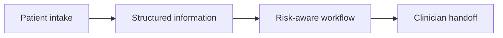

# MindBridge Health

> **Status: active development.** MindBridge is not a finished clinical product, diagnostic system, or substitute for professional judgment. Current software should be treated as a developing intake and workflow platform rather than production clinical infrastructure.

MindBridge is an AI-assisted **digital front door for mental-health clinics**.

The system is being built around the intake period before a patient sees a clinician: collecting structured context, reducing repetitive administration, supporting triage, and turning fragmented patient information into a clearer clinician handoff.

Live site: https://www.mindbridge.health

## Product direction



Automation supports intake and coordination. Clinical decisions remain with professionals.

MindBridge is designed to support:

- guided patient intake
- structured symptom, context, and goal collection
- clinician-ready handoff summaries
- risk-aware triage workflows
- appointment and clinic workflow integration
- matching patients to appropriate services or clinicians
- clear boundaries between automated support and clinician decision-making

The objective is not to replace clinical judgment. It is to reduce the administrative and information bottleneck around access to care.

## Current application

The current repository runs as a single Next.js application and includes:

- public and authenticated application surfaces
- structured intake workflows
- server-side triage routes
- Supabase-backed data handling
- controlled portal access
- authenticated and unauthenticated usage boundaries
- signed usage limiting for public demo routes
- production deployment at `mindbridge.health`

## Engineering priorities

MindBridge is being developed around four constraints:

1. **Structured information** — patient context should arrive in a form that is useful downstream.
2. **Access control** — privileged application surfaces and data paths must remain explicitly gated.
3. **Traceable workflows** — important decisions and transformations should have a clear technical path.
4. **Clinical boundaries** — software assists intake and coordination; it does not silently substitute for professional judgment.

## Local development

```bash
npm install
npm run dev
```

## Production

Production URL:

```text
https://www.mindbridge.health
```

Required deployment configuration includes the application URL, authentication configuration, Supabase credentials, and server-side secrets. Secrets are supplied through deployment environment variables and must never be committed to the repository.
